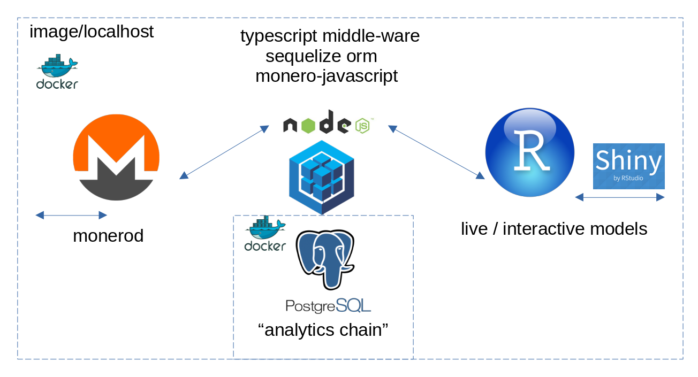

# Analitiko 

Monero blockchain analytics and exploratory data analysis tools.


## About

* This node.js (typescript) middleware synchronizes a Postgresql database for analytics
* Blocks are extracted from the Monero LMDB (lightning mapped database) via [monero-javascript](https://www.npmjs.com/package/monero-javascript)
* The Postgresql is imported into an RStudio project where analysis and models can be prepared
* [ WIP ] living, breathing models constantly updating based on new blocks
* NRPS stack
    - node.js middleware
    - r statistical programming
    - postgresql database
    - sequelize object relationship mapping (ORM)



## Project Layout

```bash
analitiko/
├── scripts            # Analytics scrips go here
├── src                # Directory of source code
   ├── test              # Test files
   ├── analitiko.ts      # Entry point for the app
   ├── config.ts         # Configuration properties / interfaces
   ├── models.ts         # Models for the databases
   ├── logging.ts        # In house logger, since TS hates console.log()
   ├── util.ts           # General purpose functions
```

## Building

1. `cd analitiko/` and run `npm i` to install modules
2. Run `npm run clean && npm run build`
3. Output is in `/dist`

## Development

* Install [Postgresql](https://www.postgresql.org/) for your machine
* Run `node dist/analitiko.js` to run server *--help for help

<br/>

```bash
Options:
      --help               Show help                                   [boolean]
      --version            Show version number                         [boolean]
  -u, --pg-user            Postgresql username               [string] [required]
  -c, --pg-credential      Postgresql password               [string] [required]
  -n, --pg-db-name         Postgresql database name          [string] [required]
  -h, --pg-host            Postgresql host                   [string] [required]
  -p, --pg-port            Postgresql port                   [string] [required]
      --daemon-host        Host and port of Monero Daemon RPC.
                                   [boolean] [default: "http://localhost:38081"]
      --daemon-user        Username of Monero Daemon RPC. [string] [default: ""]
      --daemon-credential  Password of Monero Daemon RPC. [string] [default: ""]
      --num-blocks         Number of blocks from tip to extract
                                                           [number] [default: 0]
      --report             FUTURE USE. Generate new analytics report on new
                           height                                      [boolean]
      --wipe-db            DEV USE. Destructive action. Wipes the Analytics
                           database.                                   [boolean]
  -l, --log-level          comma separated list of log levels to maintain (e.g.
                           -l ERROR,INFO,DEBUG)                         [string]

Missing required arguments: pg-user, pg-credential, pg-db-name, pg-host, pg-port
```

```bash
[me@linux analitiko]$ node dist/analitiko.js -u USER -c PASSWORD -h localhost -p PORT -n DB_NAME --num-blocks <number of blocks behind to start sync (e.g. get the last 300 blocks)> -l ERROR,INFO --wipe-db
[INFO]  2022-03-26T05:30:55.250Z => verified monero daemon sync
[INFO]  2022-03-26T05:30:55.257Z => executing analytics daemon sync, this may take a while...
[INFO]  2022-03-26T05:30:55.487Z => Connection has been established successfully.
[INFO]  2022-03-26T05:30:55.519Z => Analytics database (0) is behind Monero LMDB (1057323) by 300 block(s)
[INFO]  2022-03-26T05:31:02.399Z => processed 100 block(s)
[INFO]  2022-03-26T05:31:08.699Z => processed 200 block(s)
[INFO]  2022-03-26T05:31:15.554Z => processed 300 block(s)
```